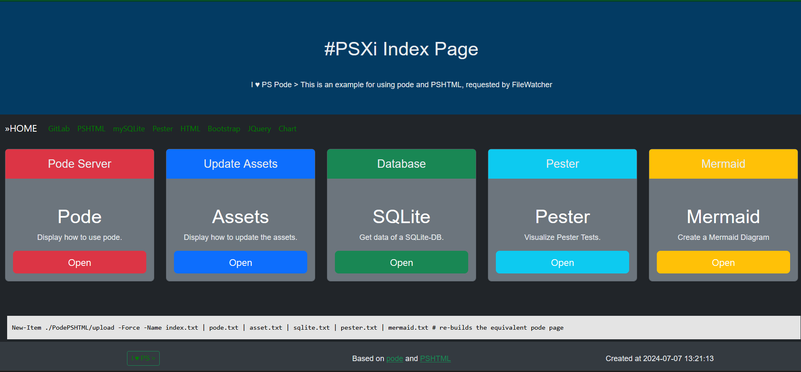
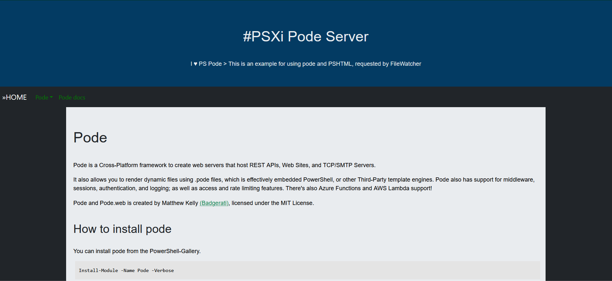
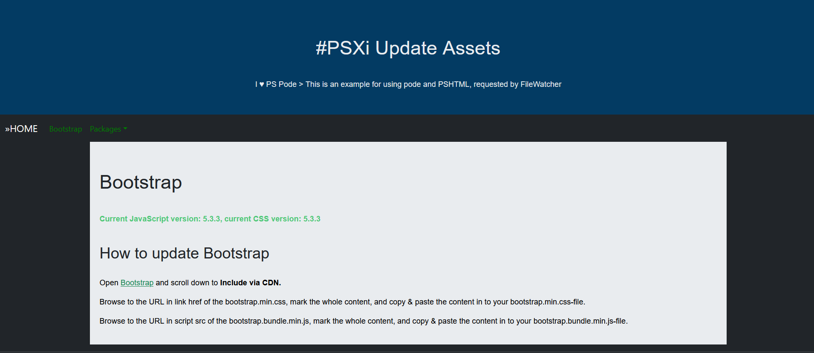
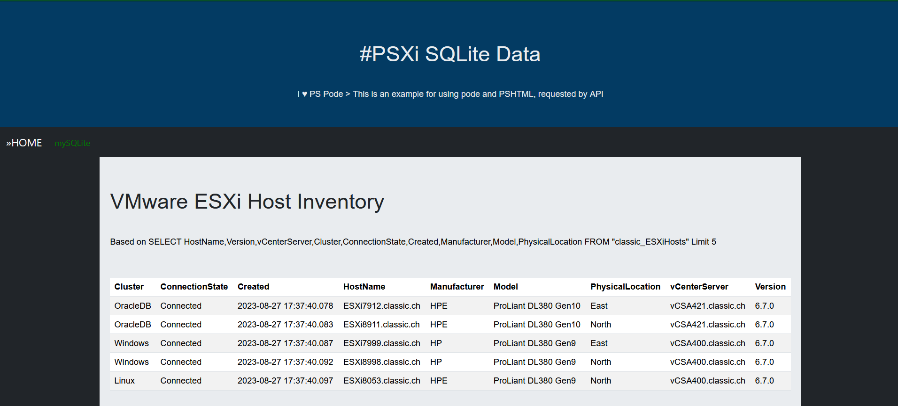
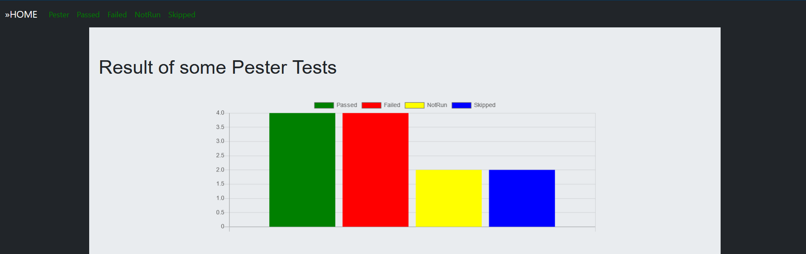
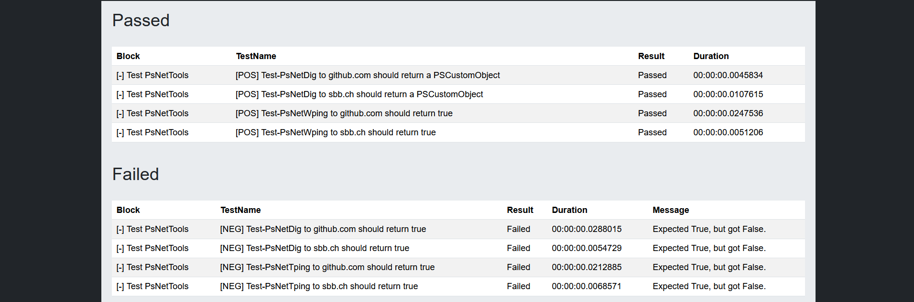
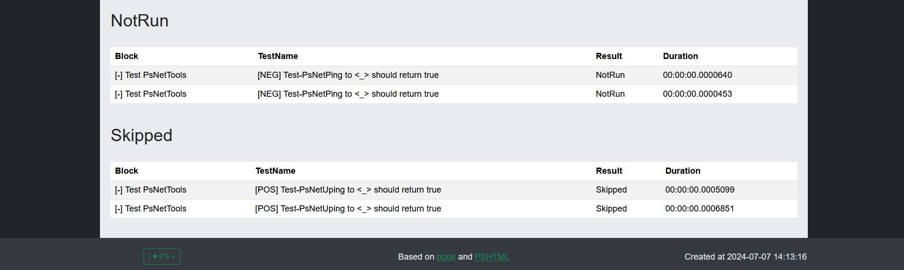
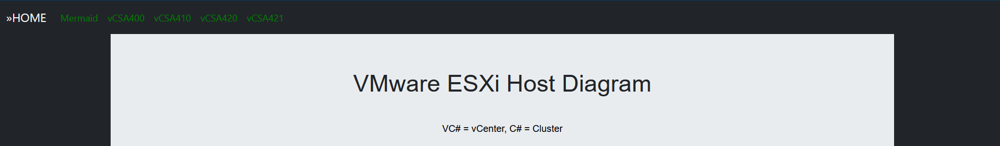
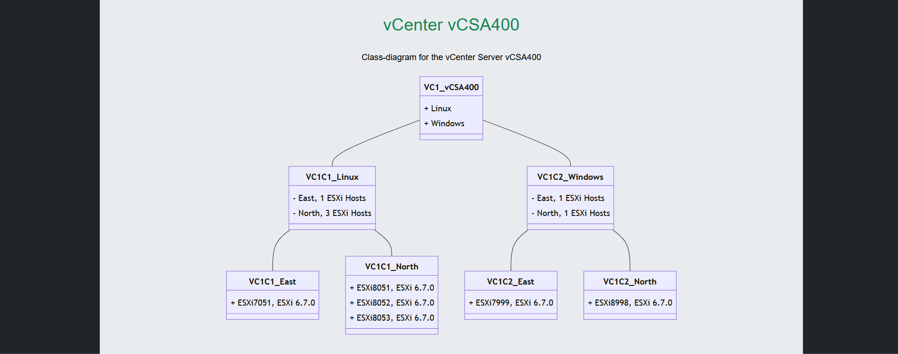

# PodePSHTML

<!-- TOC -->

- [PodePSHTML](#podepshtml)
    - [Overview](#overview)
        - [Start page](#start-page)
        - [Pode page](#pode-page)
        - [Asset page](#asset-page)
        - [SQLite page](#sqlite-page)
        - [Pester page](#pester-page)
        - [Mermaid page](#mermaid-page)
    - [FileWatcher](#filewatcher)
        - [Re-build Index by FileWatcher](#re-build-index-by-filewatcher)
        - [Re-build Pode by FileWatcher](#re-build-pode-by-filewatcher)
        - [Re-build Asset by FileWatcher](#re-build-asset-by-filewatcher)
        - [Re-build SQLite by FileWatcher](#re-build-sqlite-by-filewatcher)
        - [Re-build Pester by FileWatcher](#re-build-pester-by-filewatcher)
        - [Re-build Mermaid by FileWatcher](#re-build-mermaid-by-filewatcher)
    - [API](#api)
        - [Re-build Index by API](#re-build-index-by-api)
        - [Re-build Pode by API](#re-build-pode-by-api)
        - [Re-build Asset by API](#re-build-asset-by-api)
        - [Re-build SQLite by API](#re-build-sqlite-by-api)
        - [Re-build Pester by API](#re-build-pester-by-api)
        - [Re-build Mermaid by API](#re-build-mermaid-by-api)

<!-- /TOC -->

## Overview

This is an example for using pode and PSHTML with mySQLite and Pester v5+.

Requires pode, PSHTML, PsNetTools, Pester and mySQLite

````powershell
Install-Module -Name Pode, PSHTML, mySQLite, PsNetTools, Pester -SkipPublisherCheck -Repository PSGallery -Force -Verbose
````

Create a root folder, for example PodePSHTML:

````powershell
New-Item -Path . -Name PodePSHTML -ItemType Directory -Force -Confirm:False
````

Change in to the new directory:

````powershell
Set-Location ./PodePSHTML
````

Clone the code from my repository:

````powershell
git clone https://github.com/tinuwalther/PodePSHTML.git
````

Start pode:

````powershell
pwsh ./PodePSHTML/PodeServer.ps1
````

````powershell
Press Ctrl. + C to terminate the Pode server
VERBOSE: Adding Route: [Get] /        # endpoint for the Index page
VERBOSE: Adding Route: [Get] /pode    # endpoint for the Pode page
VERBOSE: Adding Route: [Get] /update  # endpoint for the Assets page
VERBOSE: Adding Route: [Get] /sqlite  # endpoint for the SQLite page
VERBOSE: Adding Route: [Get] /pester  # endpoint for the Pester Tests page
VERBOSE: Adding Route: [Get] /mermaid # endpoint for the Mermaid Diagram page
````

Open your preffered browser and enter http://localhost:8080/ in the address - enjoy PodePSHTML!

### Start page



This is the default index page. Here you can cklick on the Buttons to visit the given page. You can re-build this page with the FileWatcher- or REST API method.

### Pode page



This page describe how you can use pode. You can re-build this page with the FileWatcher- or REST API method.

### Asset page



This page describe how you can update the assets for Bootstrap, Jquery, Chartjs and Mermaid. You can re-build this page with the FileWatcher- or REST API method.

### SQLite page



This page display some data of a table from a local SQLite database. The database is located at ./PodePSHTML/db/psxi.db and contains the tables classic_ESXiHosts, classic_summary, cloud_ESXiHosts, and cloud_summary to create a query for. You can update this page with the FileWatcher- or REST API method.

### Pester page



This page display the result of some Pester Tests. The Script for the PesterTests is located at ./PodePSHTML/bin/Invoke-PesterResult.Tests.You can update this page with the FileWatcher- or REST API method. ps1.

### Mermaid page



This page display a Diagram of an ESXi Host Inventory from a local SQLite database. The database is located at ./PodePSHTML/db/psxi.db. It runs a query on the table classic_ESXiHosts. You can update this page with the FileWatcher- or REST API method.

[TOP](#)

## FileWatcher


There is a FileWatcher registered on ./PodePSHTML/upload.

````powershell
VERBOSE: Creating FileWatcher for './PodePSHTML/upload'
VERBOSE: -> Registering event: Changed
VERBOSE: -> Registering event: Created
VERBOSE: -> Registering event: Deleted
VERBOSE: -> Registering event: Renamed
````

The FileWatcher monitors files (with an extension) in the folder. It wait for events of type Changed, Created, Deleted, and Renamed.

### Re-build Index by FileWatcher

Re-builds the Index.pode page:

````powershell
New-Item ./PodePSHTML/upload -Force -Name index.txt
````

### Re-build Pode by FileWatcher

The FileWatcher monitors for a file pode.txt of the type Created or Changed (Move-Item, New-Item).

Re-builds the Pode-Server.pode page:

````powershell
New-Item ./PodePSHTML/upload -Force -Name pode.txt
````

### Re-build Asset by FileWatcher

The FileWatcher monitors for a file asset.txt of the type Created or Changed (Move-Item, New-Item).

Re-builds the Update-Assets.pode page:

````powershell
New-Item ./PodePSHTML/upload -Force -Name asset.txt
````

### Re-build SQLite by FileWatcher

The FileWatcher monitors for a file sqlite.txt of the type Created or Changed (Move-Item, New-Item).

Re-builds the SQLite-Data.pode page:

````powershell
New-Item ./PodePSHTML/upload -Force -Name sqlite.txt
````

Re-builds the SQLite-Data.pode page with the following Sql-Statement:

````powershell
$SqlQuery = 'SELECT * FROM "classic_ESXiHosts" Limit 10'
$SqlQuery | Set-Content -Force -Path ./PodePSHTML/upload/sqlite.txt
````

````powershell
$SqlQuery = 'SELECT HostName, Version, vCenterServer, Cluster, ConnectionState, Created, Manufacturer, Model, PhysicalLocation FROM "classic_ESXiHosts" Limit 5'
$SqlQuery | Set-Content -Force -Path ./PodePSHTML/upload/sqlite.txt
````

### Re-build Pester by FileWatcher

The FileWatcher monitors for a file pester.txt of the type Created or Changed (Move-Item, New-Item).

Re-builds the Pester-Result.pode page:

````powershell
New-Item ./PodePSHTML/upload -Force -Name pester.txt
````

### Re-build Mermaid by FileWatcher

The FileWatcher monitors for a file mermaid.txt of the type Created or Changed (Move-Item, New-Item).

Re-builds the Mermaid-Diagram.pode page:

````powershell
New-Item ./PodePSHTML/upload -Force -Name mermaid.txt
````

[TOP](#)

## API


It's also possible, to send REST API requests to pode. For each of the pages exists an endpoint.

````powershell
VERBOSE: Adding Route: [Post] /api/index   #API endpoint for the Index page
VERBOSE: Adding Route: [Post] /api/pode    #API endpoint for the Pode page
VERBOSE: Adding Route: [Post] /api/asset   #API endpoint for the Assets page
VERBOSE: Adding Route: [Post] /api/sqlite  #API endpoint for the SQLite page
VERBOSE: Adding Route: [Post] /api/pester  #API endpoint for the Pester Tests page
VERBOSE: Adding Route: [Post] /api/mermaid #API endpoint for the Mermaid Diagram page
````

### Re-build Index by API

Re-builds the Index.pode page:

````powershell
Invoke-WebRequest -Uri http://localhost:8080/api/index -Method Post
````

````powershell
StatusCode        : 200
StatusDescription : OK
Content           : Page created: Index.pode
````

### Re-build Pode by API

Re-builds the Pode-Server.pode page:

````powershell
Invoke-WebRequest -Uri http://localhost:8080/api/pode -Method Post
````

````powershell
StatusCode        : 200
StatusDescription : OK
Content           : Page created: Pode-Server.pode
````

### Re-build Asset by API

Re-builds the Update-Assets.pode page:

````powershell
Invoke-WebRequest -Uri http://localhost:8080/api/asset -Method Post
````

````powershell
StatusCode        : 200
StatusDescription : OK
Content           : Page created: Update-Assets.pode
````

### Re-build SQLite by API

Re-builds the SQLite-Data.pode page with the following Sql-Statement:

````powershell
$SqlQuery = 'SELECT * FROM "classic_ESXiHosts" Limit 7'
Invoke-WebRequest -Uri http://localhost:8080/api/sqlite -Method Post -Body $SqlQuery
````

````powershell
$SqlQuery = 'SELECT HostName, Version, vCenterServer, Cluster, ConnectionState, Created, Manufacturer, Model, PhysicalLocation FROM "classic_ESXiHosts" Limit 7'
Invoke-WebRequest -Uri http://localhost:8080/api/sqlite -Method Post -Body $SqlQuery
````

````powershell
StatusCode        : 200
StatusDescription : OK
Content           : Page created: SQLite-Data.pode
````

### Re-build Pester by API

Re-builds the Pester-Result.pode page:

````powershell
Invoke-WebRequest -Uri http://localhost:8080/api/pester -Method Post
````

````powershell
StatusCode        : 200
StatusDescription : OK
Content           : Page created: Pester-Result.pode
````

### Re-build Mermaid by API

Re-builds the Mermaid-Diagram.pode page:

````powershell
Invoke-WebRequest -Uri http://localhost:8080/api/mermaid -Method Post
````

````powershell
StatusCode        : 200
StatusDescription : OK
Content           : Page created: Mermaid-Diagram.pode
````
